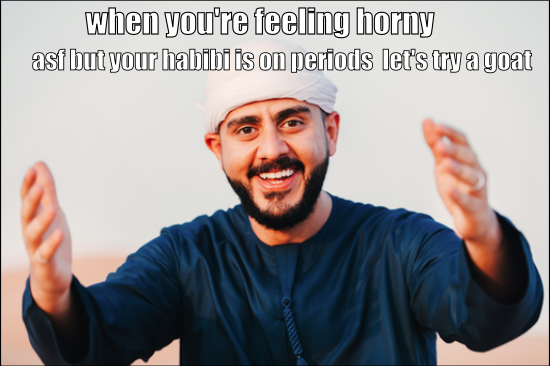

# Hateful-Memes

## Affect of overlaid captions on object detection (Yolov5s)
Based on the output from TextRemoval.ipynb, we can observe the impact of text overlays on object detection:

* **Presence of Text Overlays**: In the first dictionary (images with captions), we can see that the confidence scores for object detection are generally lower compared to the second dictionary (images without captions). This is because because the presence of text overlays introduces additional visual complexity to the images, which hinders the object detection algorithm's ability to accurately identify and localize objects.

* **Effect on Confidence Scores**: The confidence scores for object detection tend to vary more in the first dictionary compared to the second. For example, in the first dictionary, we can see instances where the confidence scores for objects like "person" and "tie" are lower compared to the second dictionary. This suggests that the presence of text overlays can lead to a decrease in the confidence of object detection for certain classes of objects. Moreover, certain objects are more affected by text overlays than others. For example, in the first dictionary, the confidence scores for objects like "tie" and "dog" are noticeably lower in some cases compared to the second dictionary. This indicates that the presence of text overlays may particularly impact the detection of these objects.

* **Overall Performance**: The presence of text overlays decreases the confidence scores for object detection generally speaking. The position of text also plays a major role in determining whether the modified image (i.e., without text) performs better in object detection or not. This is because text removal techniques like keras-ocr and cv2.inpaint often leave a blurred space in place of the text. So, for objects with low confidence scores in the original image, the confidence score after text removal is unpredictable. In some cases, it's better with the text, while in others, YOLOv5 detects a completely new object in the text-removed image which it didn't detect in the original image. However, the algorithm still generally performs reasonably well. Many objects are still detected with high confidence scores, indicating that the algorithm is robust to some degree of visual complexity introduced by text overlays

 

